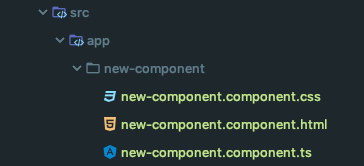
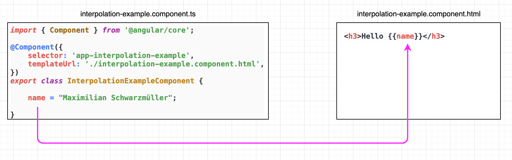
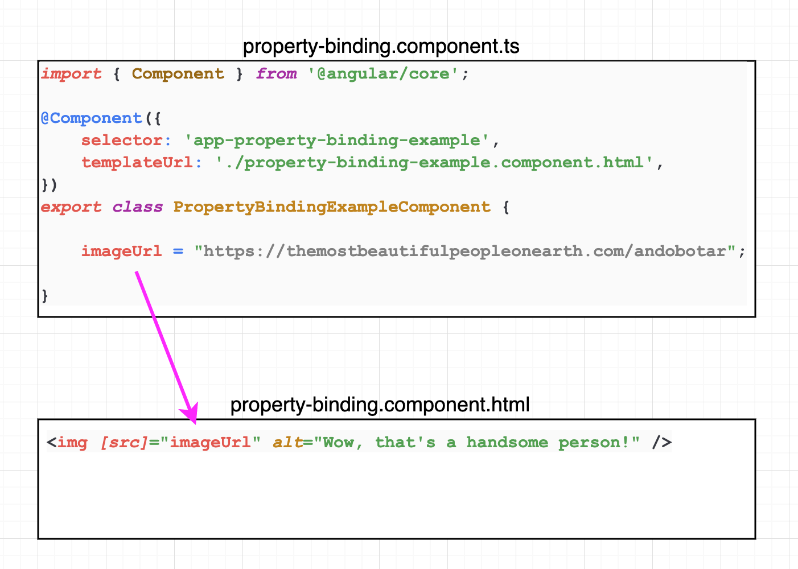
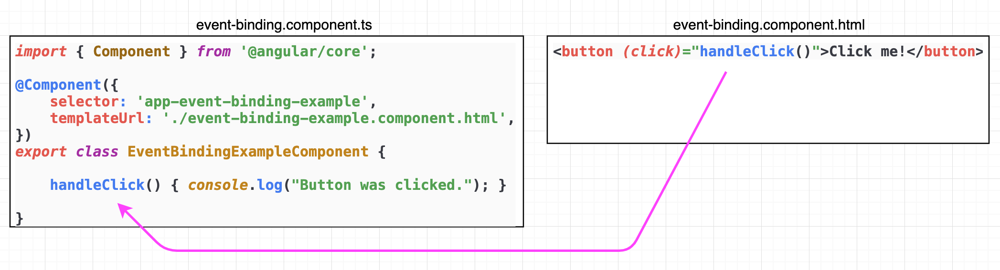

# Components

As we already know, components are probably the most important building blocks of an angular application. Let's see how
to create one.

## Component creation

### Manual way

We can go about creating our components the manual way, creating everything by hand:

- in the app folder, create a new folder with the name of the component (kebab case)
- in this new folder, let's create .ts file named new-component.component.ts (the component file name is also kebab
  case)
- in this file, lets create the class and decorate it with the `@Component()` decorator (imported from @angular/core):

```typescript
import {Component} from '@angular/core';

@Component({
  selector: 'app-new-component',
  templateUrl: './new-component.component.html',
  styleUrls: ['./new-component.component.css']
})
export class NewComponent {

  constructor() {
  }

}
```

- create the html template file: new-component.component.html
- create the css file: new-component.component.css
- and as the last step, let's import and register the newly created component with the NgModule in the app.module.ts
  file:

```typescript
import {NgModule} from '@angular/core';
import {BrowserModule} from '@angular/platform-browser';
import {AppComponent} from './app.component';
import {NewComponent} from './new-component/new-component.component.ts';

@NgModule({
  declarations: [
    AppComponent,
    NewComponent
  ],
  imports: [BrowserModule],
  exports: [],
  providers: [],
  bootstrap: [AppComponent]
})
export class AppModule {
}
```

This is what our folder sturcture should look like at this point:



### CLI tool

When it comes to creating any kind of building block for an Angular app, the easiest (and recommended) way is to use the
CLI. This holds true for components as well. All that long and boring work that went into creating a single component
manually can be replaced by a four-word command in the terminal (you will need to navigate to the project folder first):

```
ng generate component name-of-component
```  

or the even shorter version:

```
ng g c name-of-component
```

The CLI tool will create and register everything for us (well, almost everything), and our component is ready to use.

> Note:  
When generating a component with the CLI, it also creates a file called `name.component.spec.ts`, which is a test file that we are not going to use for the time being. You can simply delete it for now, or create your components with the `--skipTests` flag to tell angular not to create it.

## Selector

We have our first component, maybe we already added a few html elements just to see what happens, but how do we tell our
app to render the view defined by our component to the screen? It's easy, we simply add the __selector__ of our new
component to the body in the html file of the desired parent component. (In our case, this is the root component). This
selector tag is by convention made up of the _app-_ prefix and the name of the component. In our example, the
app.component.html would look like this:

```angular2html
<h2>App title</h2>
<app-name-of-component></app-name-of-component>
<br>
<div>Some other content</div>
```

The selector tells Angular to create and insert an instance of this component wherever it finds the corresponding tag in
the template HTML.

> Note:  
Angular implements __view encapsulation__, which means the css file attached to the component will take effect only on the component it is connected to. Even if we add styling to a very generic `div` selector in our css file, it will not affect the  divs of other components. (This behavior can be overridden, but that is hardly ever needed)

## Communication between the .ts and .html files

The .html file defines the template, and the .ts file holds all our logic and data. By making them talk to each other,
we can bring our component to life. This is done using the Angular template syntax, which alters the HTML based on the
app's logic and the state of the app and the DOM.

### Interpolation

Interpolation refers to embedding expressions into marked up text. To display any value stored in a property of the
component class, we can use the interpolation syntax. Let's say we have a `greetings = 'Hello'` property. To display it,
we can do the following in our HTML template:

```angular2html
<h2>{{greetings}} World!</h2>
```

Even better, we can put any function call or expression between these double curly braces. As long as they resolve to a
string, Angular will have no problems displaying the results.


### Property binding

Property binding is a one-way data binding mechanism where the direction of data flow is _source-to-view_, or in other
words, the value flows from the .ts file, to the .html file. We use it to set the properties of the targeted html
element or properties with @Input() decorators. (More on that later.)

Property binding is accomplished by using square brackets (`[]`). For example:

```angular2html

<button [disabled]="isDisabled">Click me</button>


```

where `isDisabled` and `imageUrl` are simple field members of the corresponding .ts file.



> Note:  
To understand property binding, it is important to keep in mind that an HTML attribute and a DOM property are two different things. Attributes are defined by HTML, properties are accessed from DOM nodes. There are some examples, where an attribute and a property has the same name, e.g. 'disabled', but don't let this fool you. Property binding works only for properties not attributes.

_### Event binding_

Event binding allows you to listen for certain events such as keystrokes, mouse movements, clicks, and touches. It
represents the opposite direction of the property binding data flow, as it is view-to-source in this case.

The Angular syntax consists of a target event name, like click, punctuated by `(` and `)` on the left, and a template
statement on the right.

```angular2html

<button (click)="onSave()">Save</button>
```

`onSave()` is a method defined in the corresponding .ts file of the component. Avoid writing complex template
statements. A method call or simple property assignment should be the norm.


[//]: # (TODO - Feladatot átmásolni)

## Exercise

Work in the folder named __WS04-Angular-Components__. First of all, we'll need to install the dependencies listed in
the __package.json__ file by executing the `npm install`command (or just `npm i` for short).  
After that, check out the provided __.ts__ and __.html__ files under src/app, and start the app by
running `ng serve WS02-Angular-Components`.(We need to specify the project name since this is a multi-project app)

1. Property binding: make sure the image in the HTML file gets its `src` from the component (instead of the currently
   hardcoded string)
2. Event binding: by clicking the button, call the method called `startChangingPictures` (don't worry about the method
   logic, it should be ok)
3. Interpolation: make sure the correct url is displayed under the button on the page

## Further reading

- [Components](https://angular.io/guide/architecture-components)
- [Template syntax](https://angular.io/guide/template-syntax)
- [ng generate flags](https://angular.io/cli/generate)

A few commonly used flags for component generation:

```shell
--inline-style      # No external stylesheet will be created
--style=scss        # Use scss 
--inline-template   # No HTML template file will be created
--skip-tests        # No test files will be created ( *.spec.ts )
```
