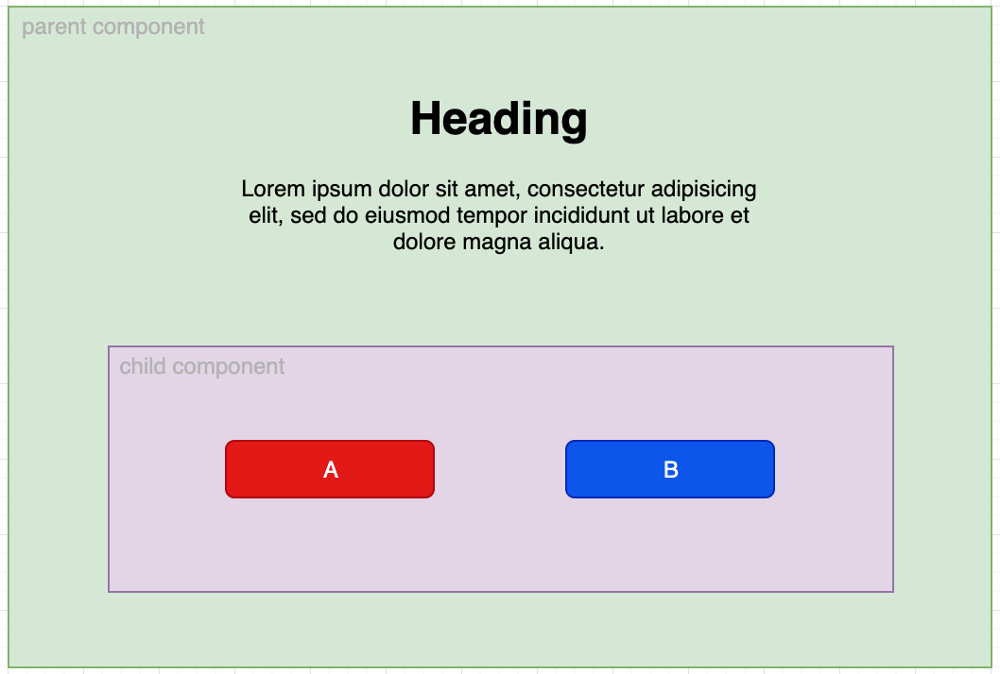
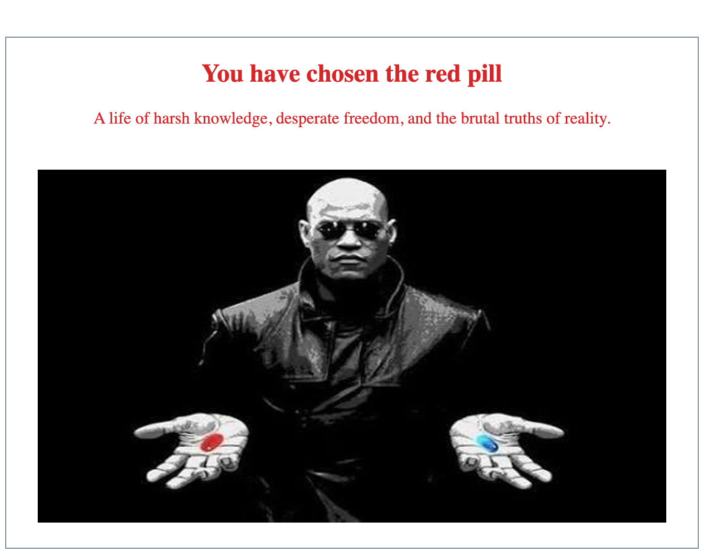

# Component interaction

As we build our application and create components, we get to a point where it becomes necessary to make our components
share some data with each other. Most often, this need arises in a child/parent component relationship. Consider this
example for such a relationship:

```angular2html

<app-parent-component>
  <app-child-component></app-child-component>
</app-parent-component>
```

Here, the selector for our child component is embedded within the opening and closing tags of our parent component,
which serves as the child's context.

In cases of child/parent interaction, we use the `@Input()` and `@Output()` property decorators, which allow Angular to
share data between a child and a parent. Think of them as ports, or doorways through which data can flow into, or out of
the child component.

## @Input()

The _@Input()_ decorator is used in a child component to let Angular know that a property in that component can receive
its value from the parent. Keep in mind that in order to use the decorator, we also have to import it.

__child.compontnt.ts:__

```typescript
import {Component, Input} from '@angular/core';

@Component({
  selector: 'app-child-component',
  templateUrl: './child-component.component.html',
  styleUrls: ['./child-component.component.css']
})
export class ChildComponent {

  @Input() item: string;

}
```

In the example, the _item_ property is of type string, but @Input() properties can have any type, even object.

The next step is to bind this property in the parent component's template. Let's assume that the parent component has
a _currentItem_ property, and it's value needs to be passed to the child.

Let's see the __parent.component.html__ file:

```angular2html
<h2>Some title</h2>
<app-child-component [item]="currentItem"></app-child-component>
<div>Some other content</div>
```

With the help of _@Input()_, Angular passes the value of the parent's currentItem property to the child component's item
property. The target in the square brackets ([] - property binding syntax) is the property decorated with _@Input_ in
the child component.

## @Output()

With the _@Output()_ decorator, we can make data flow from the child up to the parent component. To make this happen, we
will need an _EventEmitter_ as well, since the data will flow out of the child as an event, and the parent listens to
these events.

First, we create a property in the child component with the type `EventEmitter` and decorate it with _@Output()_:

```typescript
@Output()
myEventEmitter = new EventEmitter();
```

Of course, `myEventEmitter` is not a very useful name. It should reflect the event that triggered the emission of data (
eg.: orcCreated). This marks the property as a doorway through which data can travel from the child to the parent. The
data travels in an event raised by the child component to let the parent know that something happened. This is exactly
what the EventEmitter does.

To see an example, let's imagine the following app structure:  


Let's assume the parent component's text depends on which button you choose in the child compnent.

To make this easier to imagine, let's say Morpheus offers you a red and a blue pill, and the one you choose will have an
effect on what he says next (the text in the parent component):  


In this case the data outflow will be triggered by the click of one of the buttons (capsules) in the __child component
template__:

```angular2html

<button (click)="choosePill('red')">red</button>
<button (click)="choosePill('blue')">blue</button>
```

`choosePill()` is a method of the child component.

Let's see the whole __child.component.ts__ file:

```typescript
import {Component, Output, EventEmitter} from '@angular/core';

@Component({
  selector: 'app-child-component',
  templateUrl: './child-component.component.html',
  styleUrls: ['./child-component.component.css']
})
export class ChildComponent {

  @Output() pillChosen = new EventEmitter<string>();

  choosePill(color: string) {
    this.pillChosen.emit(color);
  }

}
```

As you can see, a click on one of the buttons calls the child component's _choosePill()_ method, which uses the
EventEmitter property called _pillChosen_ to emit the event with the actual data defined within the parentheses. This
particular example emits a string, but it can also be any type of data.

So far so good, but we also need to catch this event in the parent to be able to read it's payload data. To do this, we
bind to the event emitted by the child (pillChosen) using the event binding syntax, like this:

__parent.component.html:__

```angular2html

<app-child-component (pillChosen)="setChosenPill($event)"></app-child-component>
```

The parent component is listening for the child component's `pillChosen` event, and calls the `setChosenPill()` method
when the event fires. The `$event` is how we tell Angular that we want to pass the payload to the method (it is
mandatory to call it that). This _event_ object contains information about the event and its data. In our case, it only
represents the string which was emitted by the child component.

Let's assume that the parent component has a property `chosenPill` of type string that holds the string that was emitted
from the child component (the two possible values are 'red' and 'blue').

__parent.component.ts:__

```typescript
import {Component} from '@angular/core';

@Component({
  selector: 'app-parent-component',
  templateUrl: './parent-component.component.html',
  styleUrls: ['./parent-component.component.css']
})
export class ParentComponent {

  chosenPill: string;

  setChosenPill(pillColor: string) {
    this.chosenPill = pillColor;
  }

}
``` 

It's important to remember that the name of the event that we bind to is determined by the name we gave to the
EventEmitter property in our child component.

For a full working example of the app above visit [this stackblitz link](https://stackblitz.com/edit/angular-kcr2yx).

> Note:  
Keep in mind that using _@Input()_ and _@Output()_ for transfering data between components is only recommended in cases of parent/child relationships. In all other cases (if you have a different relationship between components, or if routing is involved) you will have to use a `service`. This approach has no restrictions, you can use it in all imaginable constellations.

[//]: # (TODO - Feladatot átmásolni)

## @Input() , @Output() exercise

Work in the folder named __WS06-Angular-Component-interaction__. Check out the starting .ts and .html files under
src/app, and start the app by executing `ng serve WS06-Angular-Component-interaction`.

0. First of all, note how we can pass the index of the elements of an array to the `*ngFor` directive
   in `superheroes.component.html`
1. Make clicking on the listed hero names call the `chooseHero()` function in the `superhero.component.ts` file, passing
   the index to it
2. When the function is called, let it `emit` an event through the `EventEmitter` property of the class (the emitted
   value should be the proper superhero object)
3. Bind the emitted event in `app.component.html` and make it call the `addHeroToArray()` method (remember to pass the
   payload - `$event`)
4. Prepare the `myHeroes` property of the `custom-army` component to receive its value as an input from its parent
5. Use property binding to have the `custom-army` component get the value of its `myHeroes` array from its parent
   component's `chosenHeroes` array

Next: [Services and Observables](../ws05-services-and-observables)

## Further reading

- [@Input() & @Output()](https://angular.io/guide/template-syntax#input-and-output-properties)
